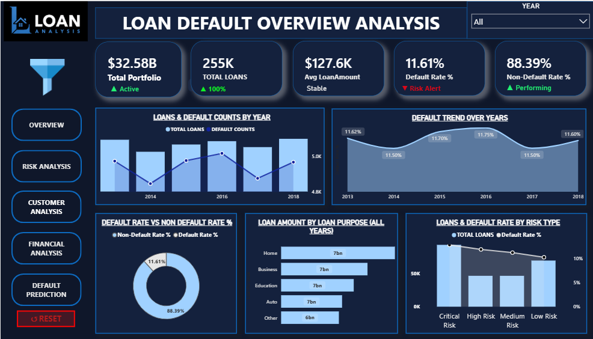
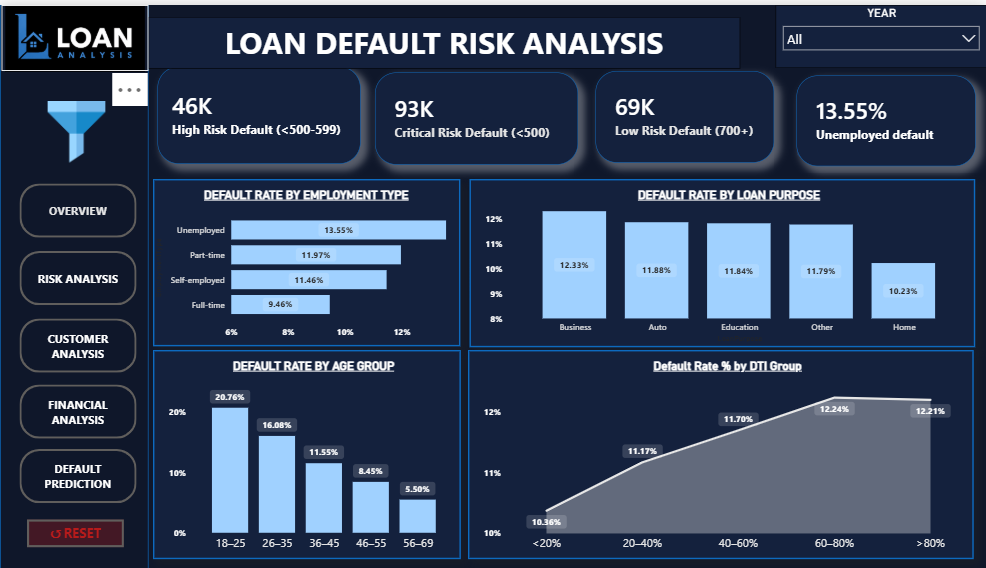
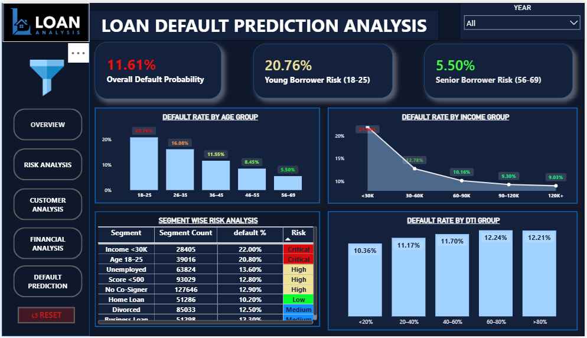

# Loan Default Risk Analysis Dashboard

## Project Overview
This project is a professional ** Loan Default Risk Analytics Dashboard** built to analyze loan default risk, borrower profiles, credit behavior, financial performance, and portfolio health.

The dashboard helps financial institutions identify high-risk borrowers, monitor default patterns, and make data-driven lending decisions.

This project is designed as a portfolio project for **Data Analyst**, **BI Developer**, and **Business Intelligence** roles.

---
## Business Problem

Loan default is one of the most important challenges for banks, NBFCs, and lending companies. A high default rate can directly impact profitability, risk exposure, and portfolio quality.

This dashboard analyzes borrower and loan data to answer key business questions:

- What is the overall default rate?
- Which borrower segments are most risky?
- How does income impact default probability?
- Which employment type has the highest default risk?
- How does DTI ratio affect repayment behavior?
- Which credit score groups contribute most to portfolio risk?
- What actions can reduce future loan defaults?

---

## Dashboard Preview

### Executive Overview

### Credit Risk Analysis

### Borrower Insights

### Financial Performance

### Default Risk Prediction

---

## Dashboard Pages

### 1. Executive Overview

Provides a high-level summary of the loan portfolio.

Key metrics include:

- Total Loans
- Total Loan Amount
- Average Loan Amount
- Default Rate
- Non-Default Rate
- Average Interest Rate
- Average Credit Score
- Portfolio Health Score

---

### 2. Credit Risk Analysis

Analyzes default risk across borrower and loan characteristics.

Visuals include:

- Default Rate by Employment Type
- Default Rate by Loan Purpose
- Default Rate by Age Group
- Default Rate by DTI Group
- High-Risk Borrower Segments
- Critical-Risk Borrower Segments

---

### 3. Borrower Insights

Focuses on customer profile and borrower behavior.

Visuals include:

- Borrower Count by Age Group
- Default Rate by Income Group
- Borrower Distribution by Education
- Mortgage Status Analysis
- Marital Status Analysis
- Co-Signer and Dependents Analysis

---

### 4. Financial Performance

Analyzes loan amount, interest rate, and portfolio value.

Visuals include:

- Average Loan Amount by Education
- Total Loan Amount Over Years
- Total Loans by Interest Rate Group
- Default Rate by Income Group
- Minimum and Maximum Loan Amount
- Minimum and Maximum Interest Rate
- Average Loan Amount

---

### 5. Default Risk Prediction

Highlights risk probability and borrower default patterns.

Visuals include:

- Overall Default Probability
- Young Borrower Risk
- Senior Borrower Risk
- Default Rate by Age Group
- Default Rate by Income Group
- Default Rate by DTI Group
- Segment-Wise Risk Analysis

---

## Dataset Description

The dataset contains borrower-level and loan-level information used to analyze loan default behavior.

| Column | Description |
|---|---|
| Loan ID | Unique identifier for each loan |
| Age | Age of the borrower |
| Income | Annual income of the borrower |
| Loan Amount | Loan amount sanctioned to borrower |
| Credit Score | Borrower credit score |
| Months Employed | Employment duration in months |
| Number of Credit Lines | Number of existing credit lines |
| Interest Rate | Interest rate charged on loan |
| Loan Term | Loan repayment duration |
| DTI Ratio | Debt-to-income ratio |
| Education | Education level of borrower |
| Employment Type | Borrower employment status |
| Marital Status | Marital status of borrower |
| Has Mortgage | Mortgage status of borrower |
| Has Dependents | Dependent status |
| Loan Purpose | Purpose of loan |
| Has Co-Signer | Co-signer availability |
| Default | Target variable indicating loan default |

---

## Key KPIs

| KPI | Description |
|---|---|
| Total Loans | Total number of loans in the portfolio |
| Total Loan Amount | Total value of issued loans |
| Average Loan Amount | Average sanctioned loan amount |
| Default Rate | Percentage of loans defaulted |
| Non-Default Rate | Percentage of performing loans |
| Average Interest Rate | Average interest rate across loans |
| Average Credit Score | Average borrower credit score |
| Average DTI Ratio | Average debt-to-income ratio |
| High-Risk Borrowers | Borrowers in high-risk credit score range |
| Critical-Risk Borrowers | Borrowers with very low credit score |

---

## Risk Segmentation

Borrowers were segmented into risk categories based on credit score and default behavior.

| Risk Category | Criteria |
|---|---|
| Low Risk | Credit Score 700+ |
| Medium Risk | Credit Score 600–699 |
| High Risk | Credit Score 500–599 |
| Critical Risk | Credit Score below 500 |

Additional risk factors considered:

- Low income
- High DTI ratio
- Unemployment
- No co-signer
- Young borrower age group
- Business loan purpose

---

## Key Insights

- Borrowers aged **18–25** show the highest default risk.
- Borrowers aged **56–69** show the lowest default risk.
- Borrowers with income below **$30K** have the highest default probability.
- Unemployed borrowers show higher default risk compared to full-time borrowers.
- Higher DTI ratio increases default probability.
- Borrowers without a co-signer show higher risk exposure.
- Home loans show comparatively lower default risk.
- Low credit score borrowers represent the most critical risk segment.

---

## Business Recommendations

Based on the analysis, the following actions are recommended:

1. Strengthen underwriting for young borrowers aged 18–25.
2. Apply stricter income verification for borrowers earning below $30K.
3. Encourage or require co-signers for high-risk borrower profiles.
4. Monitor borrowers with high DTI ratios more closely.
5. Reduce exposure to critical-risk credit score groups.
6. Expand lending to low-risk borrower segments.
7. Review business loan approval criteria due to higher risk.
8. Use borrower risk segmentation for better credit decision-making.

---

## Tools Used

- Power BI
- DAX
- Power Query
- Data Modeling
- Data Cleaning
- Data Visualization
- Business Intelligence
- Risk Analytics

---

## Skills Demonstrated

- Data Cleaning
- Data Transformation
- KPI Development
- Dashboard Design
- Credit Risk Analysis
- Borrower Segmentation
- Financial Analysis
- Business Insight Generation
- BI Storytelling
- Portfolio Presentation

---

## Project Outcome

This dashboard helps financial institutions:

- Identify high-risk borrowers
- Understand loan default behavior
- Monitor portfolio performance
- Reduce risk exposure
- Improve credit approval strategy
- Make data-driven lending decisions

## Author

**Anurag TIjare **  
Data Analyst / BI Developer

LinkedIn: Coming Soon
GitHub: Coming Soon
